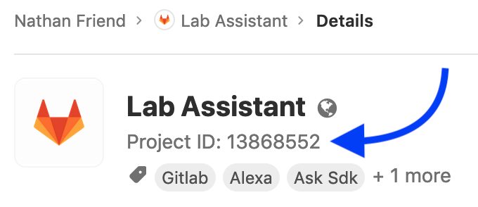

# Lab Assistant

An Alexa skill for managing your open-source projects hosted on [GitLab.com](https://gitlab.com/) using your voice.

## Installation

Enable the Lab Assistant skill on your Amazon site of choice:

_Note: these are placeholder links until the skill is live._

- [Amazon.com]()
- [Amazon.ca]()
- [Amazon.co.uk]()
- [Amazon.com.au]()
- [Amazon.in]()

_Don't see your local Amazon store? You can help out by translating Lab Assistant into your language! See the **Contributing** section below for more details._

## Usage

- "Alexa, open Lab Assistant"

### Todos

- "Todos"
- "Do I have any todos?"
- "How many todos do I have?"
- "What does my day look like?"
- "Read me my todos"

### Issues

- "Issues"
- "Do I have any issues assigned to me?"
- "How many issues do I have?"
- "Read me my issues"

### Merge Requests

- "Merge requests"
- "Do I have any merge requests?"
- "How many merge requests do I have"
- "Read me my merge requests"

### Pipelines

- "Run a new pipeline"
- "Execute a deployment"
- "Create a test pipeline"
- "Initiate a test build"
- "Begin a new analysis job on my project"

This command in particular is quite flexible in how it can be invoked. To get a better understanding of all the ways you can run a pipeline on your project, see the `RunPipelineIntent` entry in [this skill's grammar file](./Lab_Assistant/models/en-US.grammar).

#### Selecting a project

The first time you run this command, Lab Assistant will ask you for the project's ID. You can find your project's ID on the project's page under the project name:

Lab Assistant will remember this ID for future invocations and won't ask you for it again.

#### Pipeline variables

Lab Assistant will **always** trigger your pipeline with the environment variable `LAB_ASSISTANT=true`.

You can trigger your pipeline with an additional environment variable in the format `LAB_ASSISTANT_<VARIABLE>=true` by including this variable in your invocation:

- "Run a new **test** pipeline"
- "Execute a **test**"
- "Launch a new **test** job"
- "Perform the **test** process"
- "Start a **test** on our code"

All of the invocations above will result in your pipeline being triggered with the following variables:

- `LAB_ASSISTANT=true`
- `LAB_ASSISTANT_TEST=true`

#### Pipeline ref

All pipelines are executed against the `master` branch of the project you specify. Interested in the ability to execute pipeline against branches other than `master`? [Open an issue](https://gitlab.com/nfriend/lab-assistant/issues/new) and let me know.

### Connecting to your GitLab.com account

Any command that requires you to connect your GitLab.com account will automatically prompt you to login, so you shouldn't have to worry about manually connecting your account. If for some reason you _do_ want to explicitly connect your account, you can say:

- "Connect my account"

To disconnect your account, disable and re-enable the Lab Assistant skill.

## FAQ

### Can I use this skill for self-managed GitLab instances?

No, this skill only integrates with [GitLab.com](https://gitlab.com/). This is because Alexa Skills must specify an OAuth provider at build time.

If you _do_ want to use this skill with a self-managed GitLab instance, you can clone this repo and deploy this code as a separate skill that is pointed at your GitLab instance.

## Developing

### Building

1. Clone this repo
2. `cd lab-assistant/Lab_Assistant/lambda/custom`
3. `npm install`
4. `npm run build`

### Building the model

This skill's model is generated using the [Alexa Skill Utterance and Schema Generator](https://github.com/KayLerch/alexa-utterance-generator) library. This library takes [en-US.grammar](./Lab_Assistant/models/en-US.grammar) and outputs [en-US.json](./Lab_Assistant/models/en-US.json). To run this process, run `npm run model`. Note that you will need a JDK installed for this command to run; it executes [alexa-generate.jar](./Lab_Assistant/models/alexa-generate.jar) which is included in this repository.

### Testing

The easiest way to develop on this project is using test-driven development through [Jest](https://jestjs.io/). You can run the tests using `npm run test` or `npm run test-watch`. See the [existing tests](https://gitlab.com/nfriend/lab-assistant/tree/master/Lab_Assistant/lambda/custom/tests) for some examples.

### i18n

This project uses [`i18next`](https://www.i18next.com/) for internationalization ("i18n"). [`i18next-scanner`](https://github.com/i18next/i18next-scanner) is used to extract the strings directly from the source into this project's [i18n directory](https://gitlab.com/nfriend/lab-assistant/tree/master/Lab_Assistant/lambda/custom/i18n). You can run this extraction process by building the project (`npm run build`) and then running `npm run translate`. Alternatively, you can run `npm run build-and-translate`.

### Linting

This project uses [Prettier](https://prettier.io/) and [TSLint](https://palantir.github.io/tslint/) to help keep the codebase consistent. You can run all linting checks using `npm run lint`. Many of the more tedious errors can be fixed automatically; to do this, run `npm run lint-fix`.

### Continuous Integration

This project includes a [pipeline](./.gitlab-ci.yml) that runs a number of automated checks to ensure tests are passing, translation files are up-to-date, and that the code contains no linting errors. Currently, the pipeline is: 

### Deploying

To deploy, run `npm run deploy`. This command uses the [Alexa Skills Kit (ASK) CLI](https://developer.amazon.com/docs/smapi/quick-start-alexa-skills-kit-command-line-interface.html) to update the latest **development** version of this skill. Production deployments/submissions are a manual process.

#### A quick note

You may notice that this project's [`.gitlab-ci.yml`](./.gitlab-ci.yml) file includes references to automated deployments (i.e., a job and stage named `deploy`). These jobs (and the corresponding `deploy` branch) are _almost_ working, but ultimately were abandoned due to limitations with the ASK CLI tool. It's possible this automated deployment process will be reintroduced in the future if the ASK CLI makes this possible. For now, deployments are created by running the `npm run deploy` command locally as described above.

## Contributing

Merge requests are welcome! :pray: :bow:

If you'd like to contribute code, see the **Developing** section above.

If you're interested in translating Lab Assistant into another language (thereby making it available in other Amazon stores), please open a merge request with translated versions of these files:

- [./Lab_Assistant/lambda/custom/i18n/en/translation.json](./Lab_Assistant/lambda/custom/i18n/en/translation.json)
- [./Lab_Assistant/models/en-US.grammar](./Lab_Assistant/models/en-US.grammar) and [./Lab_Assistant/models/en-US.base.json](./Lab_Assistant/models/en-US.base.json)
  - This is used to generate [./Lab_Assistant/models/en-US.json](./Lab_Assistant/models/en-US.json)
- [./Lab_Assistant/skill.json](./Lab_Assistant/skill.json)
